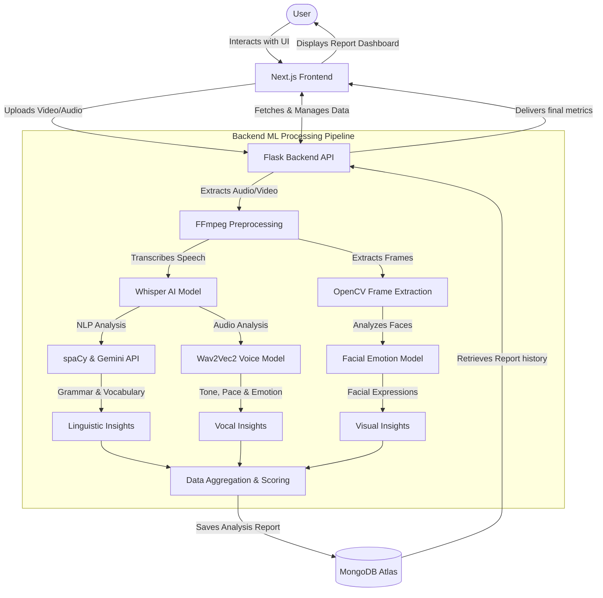

<h1 align="center">
  <a href="https://github.com/CommunityOfCoders/Inheritance-2024">
    
  </a>
  <br>
     Eloquence 
</h1>

<div align="center">

    Eloquence - AI driven public speaking tutor
</div>
<hr>

<details>
<summary>Table of Contents</summary>

- [Description](#description)
- [Links](#links)
- [Tech Stack](#tech-stack)
- [Progress](#progress)
- [Future Scope](#future-scope)
- [Applications](#applications)
- [Project Setup](#project-setup)
- [Usage](#usage)
- [Team Members](#team-members)
- [Mentors](#mentors)
- [Screenshots](#screenshots)

</details>

## 📝Description
Eloquence is an AI-powered app that enhances public speaking by providing feedback on pace, modulation, volume, facial expressions, and vocabulary. It offers personalized tips during practice sessions to help users refine their delivery, build confidence, and communicate more effectively in any setting, from presentations to casual conversations.

## 🔗Links

- [GitHub Repository](https://github.com/PMS61/Eloquence)
- [Demo Video]()
- [Drive Link to Screenshots of your project]()
- [Hosted Website Link]()
- [Hosted Backend Link]()


## 🤖Tech-Stack

#### Front-end
- 
-  
#### Back-end

- 


#### Database
- 

#### DL Framework

- 
- 

## 📊 Workflow Architecture

Here is the high-level workflow architecture of the Eloquence (Oratio) platform, detailing how user data flows through the Next.js frontend, Flask backend, and various Machine Learning models for comprehensive analysis.



## 📈Progress
List down all the fully implemented features in your project

- [x]  Vocabulary Analysis: The app analyzes the user's vocabulary, providing feedback on word choice, complexity, and variety.
- [x]  Voice Analysis: The app evaluates the user's voice, including pace, modulation, and emotional tone, offering suggestions for improvement.
- [x]  Facial Emotion Recognition: The app uses AI to detect and analyze facial expressions, providing insights into non-verbal communication.
- [x]  Overall Report and Scoring: The app generates a comprehensive report and scores the user based on their performance in vocabulary, voice, and facial expression analysis.


## 🔮Future Scope
<strong>Real-Time Feedback:</strong> Implement real-time feedback during live speaking sessions

<strong>Personalized training sessions : </strong> Allowing user to practice on a certain context and improve their public speaking

## 💸Applications
<strong>Public Speaking Training: </strong> Ideal for individuals looking to improve their public speaking skills for presentations, speeches, and debates.

<strong>Corporate Training: </strong>Companies can use Eloquence to train employees in effective communication, enhancing their presentation and interpersonal skills.

<strong>Education:</strong> Students can benefit from personalized feedback to improve their oral communication skills, which are crucial for academic success and future career prospects.

<strong>Job Interviews:</strong> Job seekers can practice and refine their interview skills, ensuring they make a positive impression on potential employers.

## 🛠Project Setup

For the Web-App 1.Clone the GitHub repo.
```bash
git clone <url>
```
2.Enter the client directory. Install all the required dependencies.
```bash
  cd client
  npm i
  npm run dev
```

3.To start the backend server:
---
First activate the Virtual enviroment
```bash
  cd server
  pip install -r requirements.txt
  flask run
```

## 👨‍💻Team Members

Add names of your team members with their emails and links to their GitHub accounts

- Prathamesh Sankhe: [GitHub](https://github.com/PMS61) | Email: pmsankhe_b23@it.vjti.ac.in
- Soham Margaj: [GitHub](https://github.com/soham555-maker) | Email: ssmargaj_b23@it.vjti.ac.in
- Zoher Vohra: [GitHub](https://github.com/zohervohra) | Email: ztvohra_b23@it.vjti.ac.in
- Dheer Joisher: [GitHub](https://github.com/DheerJoisher) | Email: drjoisher_b23@it.vjti.ac.in

## 👨‍🏫Mentors

Add names of your mentors with their emails and links to their GitHub accounts

- [Mentor 1 Aaditya Padte](https://github.com/Aaditya8C): aadityajp0419@gmail.com
- [Mentor 2 Vedant Kale](https://github.com/VedantKale08): vedantkale8114@gmail.com
- [Mentor 3 Aniket Jadhav](https://github.com/DevAniket010): aj230375@gmail.com


## 📱Screenshots


