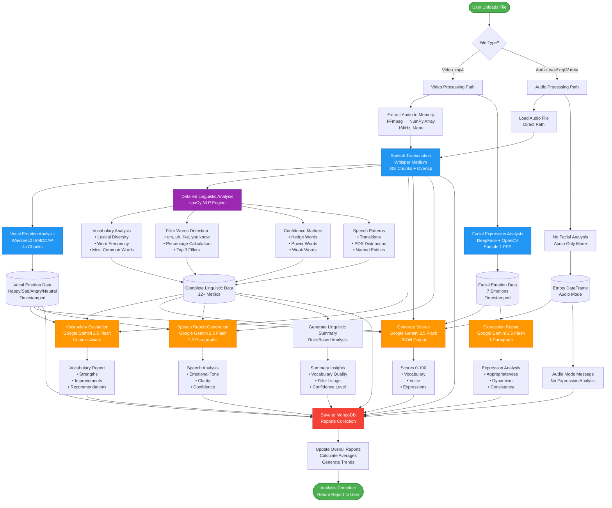
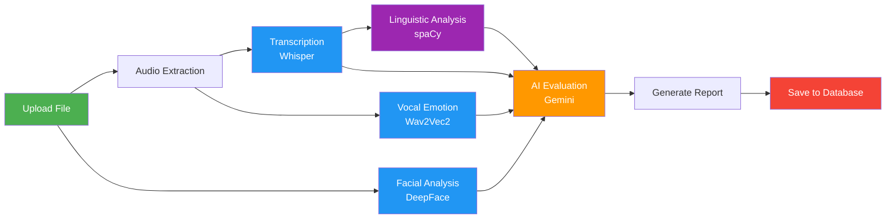
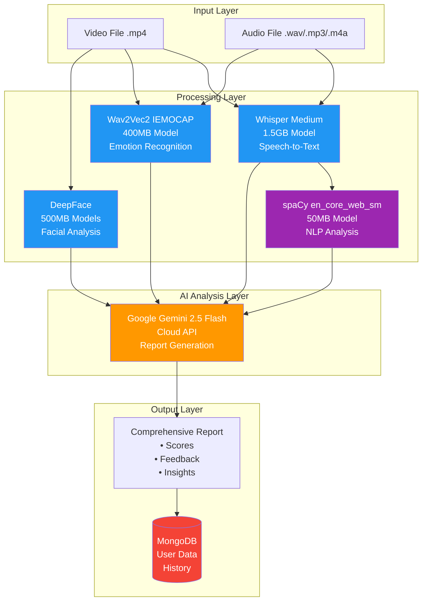
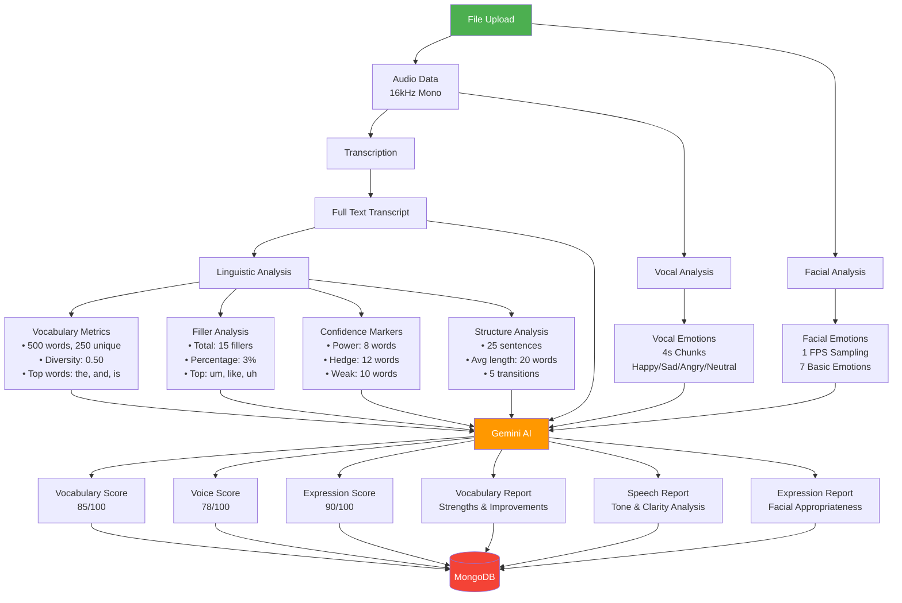
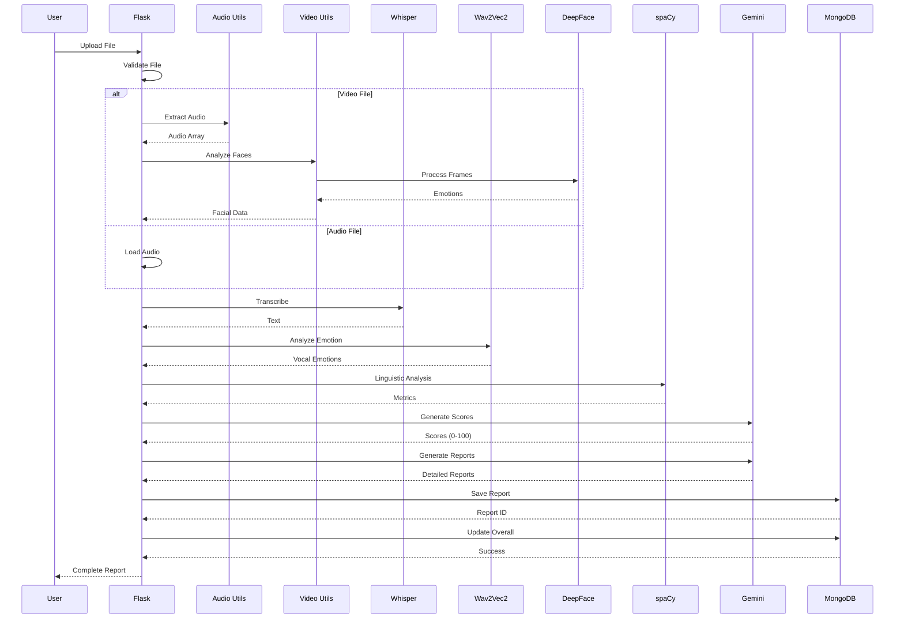

# ORATIO Analysis Pipeline - Mermaid Diagram

## Complete Analysis Flow

## Simplified High-Level Flow

## Model Architecture

## Data Flow with Metrics

## Timeline View

```mermaid
gantt
    title ORATIO Analysis Pipeline Timeline
    dateFormat X
    axisFormat %Ss
    
    section Upload
    File Upload & Validation    :0, 2s
    
    section Audio Processing
    Audio Extraction (Video)     :2, 5s
    Transcription (Whisper)      :7, 30s
    Vocal Emotion (Wav2Vec2)     :7, 15s
    
    section Video Processing
    Facial Analysis (DeepFace)   :2, 20s
    
    section NLP Analysis
    Linguistic Analysis (spaCy)  :37, 5s
    
    section AI Generation
    Vocabulary Evaluation        :42, 8s
    Score Generation             :50, 6s
    Speech Report                :56, 8s
    Expression Report            :64, 6s
    
    section Storage
    Save to Database             :70, 2s
    Update Overall Reports       :72, 3s
```

## Component Interaction

## Legend

- 🟢 **Green**: Start/End points
- 🔵 **Blue**: ML Model Processing (Whisper, Wav2Vec2, DeepFace)
- 🟣 **Purple**: NLP Analysis (spaCy)
- 🟠 **Orange**: AI Generation (Gemini)
- 🔴 **Red**: Database Operations (MongoDB)

## Key Metrics

| Stage | Model | Size | Processing Time | Output |
|-------|-------|------|----------------|--------|
| Transcription | Whisper Medium | 1.5GB | ~30s for 5min audio | Full text transcript |
| Vocal Emotion | Wav2Vec2 IEMOCAP | 400MB | ~15s for 5min audio | Emotion per 4s chunk |
| Facial Analysis | DeepFace | 500MB | ~20s for 5min video | Emotion per second |
| Linguistic | spaCy | 50MB | ~5s | 12+ metrics |
| AI Reports | Gemini API | Cloud | ~20s total | Scores + Reports |

**Total Processing Time**: ~60-90 seconds for a 5-minute video
